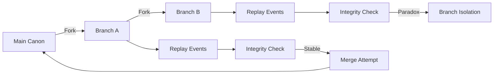

# PURGE Engine — System Diagrams

This document provides formal diagrams describing the structural and data-flow
architecture of the PURGE narrative engine. Diagrams are rendered using Mermaid
and are intended for both technical inspection and academic communication.

---

## 1. Core Engine Dependency Graph

This diagram illustrates the dependency relationships between major subsystems
in the `core/` layer.

```mermaid
graph TD
    Canon --> Validator
    Canon --> Integrity
    Canon --> Snapshot
    Canon --> DependencyGraph

    Validator --> Axiom
    Validator --> Rules

    Branching --> Canon
    BranchMerge --> Branching
    Replay --> Snapshot

    Paradox --> Integrity
    Paradox --> Repair

    VerseMind --> Intent
    VerseMind --> Schema
    VerseMind --> Prompt
    VerseMind --> LLMBackend

    LLMBackend --> Ollama


    Analytics --> Canon
    Telemetry --> Canon
    Risk --> Canon
    Fatigue --> Canon
````

**Interpretation**

* `Canon` is the central state authority.
* Validation, integrity, and snapshots depend on canon, not vice versa.
* AI systems (VerseMind) never bypass validation or mutate canon directly.
* Analytics and telemetry are observational only.

---

## 2. Narrative Mutation Data Flow

This diagram represents the invariant pipeline through which narrative changes
are proposed, validated, and applied.

```mermaid
flowchart TD
    Intent[Human or AI Intent]
    -->|Optional| LLM[LLM Backend]
    --> Proposal[Structured Proposal]


    Proposal --> Validation[Rule Validation]

    Validation -->|Rejected| Explanation[Explain Violation]
    Validation -->|Approved| Event[Event Construction]

    Event --> CanonMutation[Canon Mutation]
    CanonMutation --> Snapshot[Snapshot Creation]
    Snapshot --> Integrity[Integrity Recalculation]
    Integrity --> Telemetry[Analytics & Telemetry]
```

**Key Properties**

* All mutations are explainable.
* Canon changes occur only through validated events.
* Integrity is recomputed after every accepted mutation.
* Observational systems never influence control flow.

---

## 3. Branching, Replay, and Paradox Handling

This diagram describes how PURGE models branching timelines and paradox isolation.



**Interpretation**

* Branches are first-class narrative timelines.
* Replay reconstructs canon deterministically.
* Paradox detection blocks unsafe merges.
* Failed branches are isolated rather than corrupting canon.

---

## 4. Diagram Usage Notes

* These diagrams are normative: engine behavior should match them.
* Changes to core architecture must update this document.
* Diagrams are suitable for inclusion in academic publications.

---

### End of Document