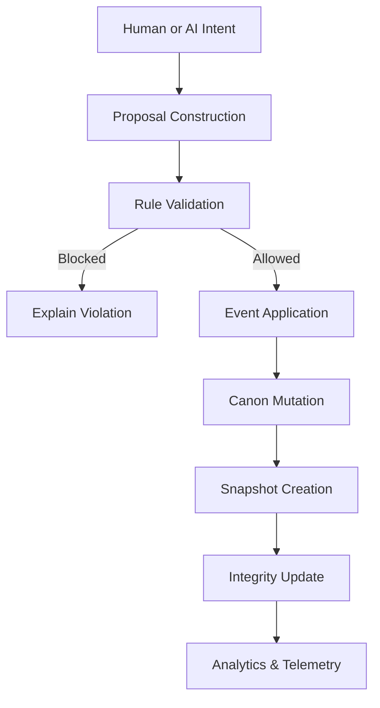

# PURGE Engine

**Procedural Universe Realtime Game Engine**

---

## Abstract

PURGE is a narrative systems engine designed to model, enforce, and evolve **story canon** under formal constraints. It treats narrative consistency as a first-class systems problem, enabling long-form, branching stories that remain coherent under human and AI-assisted authorship.

Unlike generative story tools, PURGE emphasizes **governance over generation**: all narrative mutations are mediated through rules, validation, and explainable decision paths.

---

## Core Contributions

PURGE introduces a unified framework for:

* Canon as an explicit, inspectable state
* Rule-based narrative validation
* Event-driven story evolution
* Branching timelines with paradox handling
* Quantitative integrity and risk metrics
* Human-in-the-loop AI narrative proposals

The engine is suitable for research into:

* AI-assisted storytelling
* Narrative consistency preservation
* Interactive fiction systems
* Story-driven game engines

---

## System Overview

At a high level, PURGE is composed of three layers:

```
UI Layer
  ├─ Canon inspection & editing
  ├─ Rule authoring
  ├─ Timeline control
  ├─ Validation console
  └─ VerseMind interface

Core Engine
  ├─ Canon state
  ├─ Rules & validation
  ├─ Event system
  ├─ Branching & replay
  ├─ Paradox detection & repair
  └─ AI proposal mediation

Persistence & Analysis
  ├─ Snapshots
  ├─ Integrity computation
  ├─ Analytics & telemetry
  └─ Risk / fatigue modeling
```

The UI layer never bypasses core validation.

---

## Architectural Flow

The canonical mutation pipeline is invariant:



This design ensures determinism, explainability, and reproducibility.

---

## Canon and Rules

### Canon

Canon represents the authoritative narrative state, including:

* Metadata (title, author, version)
* Truths (facts about the world)
* Rules (constraints)
* Events (historical mutations)
* Snapshots and integrity metrics
* Dependency graph
* Active narrative branch

Canon evolves only through validated events.

---

### Rules

Rules are formal constraints that:

* Express narrative prohibitions or requirements
* Depend on contextual predicates (e.g., act number)
* Provide explicit reasons when violated
* Decay or strengthen over time

All rule enforcement is deterministic and inspectable.

---

## Events and Timelines

Events are treated as **narrative transactions**:

* Discrete
* Validated
* Logged
* Replayable
* Dependency-aware

Timelines may branch, replay, or merge under constraint reconciliation. Linear time is not assumed.

---

## Branching Model

PURGE uses a disciplined branching strategy:

* `main` — stable, citable engine state
* `dev` — integration and staging
* `experimental/*` — isolated research experiments

This mirrors research practice: published theory vs. working drafts vs. lab experiments.

---

## VerseMind: AI-Assisted Proposals

VerseMind is an AI interface layer that:

* Interprets natural-language intent
* Produces structured narrative proposals
* Supplies confidence and rationale
* Never mutates canon directly

All AI output is subject to:

1. Human approval
2. Formal validation

This prevents AI-induced canon collapse.

### LLM Backends

PURGE supports optional LLM backends through the VerseMind abstraction layer.
Local execution via experimental backends (such as Ollama) may be used for
offline or research-oriented workflows.

No LLM backend is required to run the engine, and all AI-generated proposals
remain subject to human approval and formal validation.


---

## Integrity, Analytics, and Risk

PURGE computes quantitative signals to evaluate narrative health:

* Integrity scores (global coherence)
* Risk metrics (instability detection)
* Fatigue models (trope overuse)
* Telemetry for longitudinal analysis

These systems observe canon but do not alter it.

---

## UI Layer

The UI is implemented using Tkinter and serves as:

* A control surface
* A debugging interface
* An inspection tool

Panels include:

* Canon editor
* Rule editor
* Timeline manager
* Validation console
* VerseMind interface
* Paradox and analytics views

The UI is intentionally thin.

---

## Project Structure

```
purge/
├── core/          # Narrative engine logic
├── ui/            # Control and inspection panels
├── main.py        # Application entry point
├── ARCHITECTURE.md
└── README.md
```

Runtime project data is excluded from version control.

---

## Running the Engine

```bash
python main.py
```

The engine launches a windowed UI for interactive narrative management.

---

## Research Status

This project is an **active research-grade prototype**.

Current focus areas:

* Canon integrity modeling
* Paradox detection and repair
* AI-human narrative collaboration
* Branch reconciliation strategies

---

## License and Use

License and citation guidelines will be added once the research scope stabilizes.

---

## Citation (Draft)

If you reference this work:

```
PURGE Engine: A Rule-Governed Narrative Systems Framework
```

---

## Documentation

* **ARCHITECTURE.md** — formal system design specification

---

### End of Document